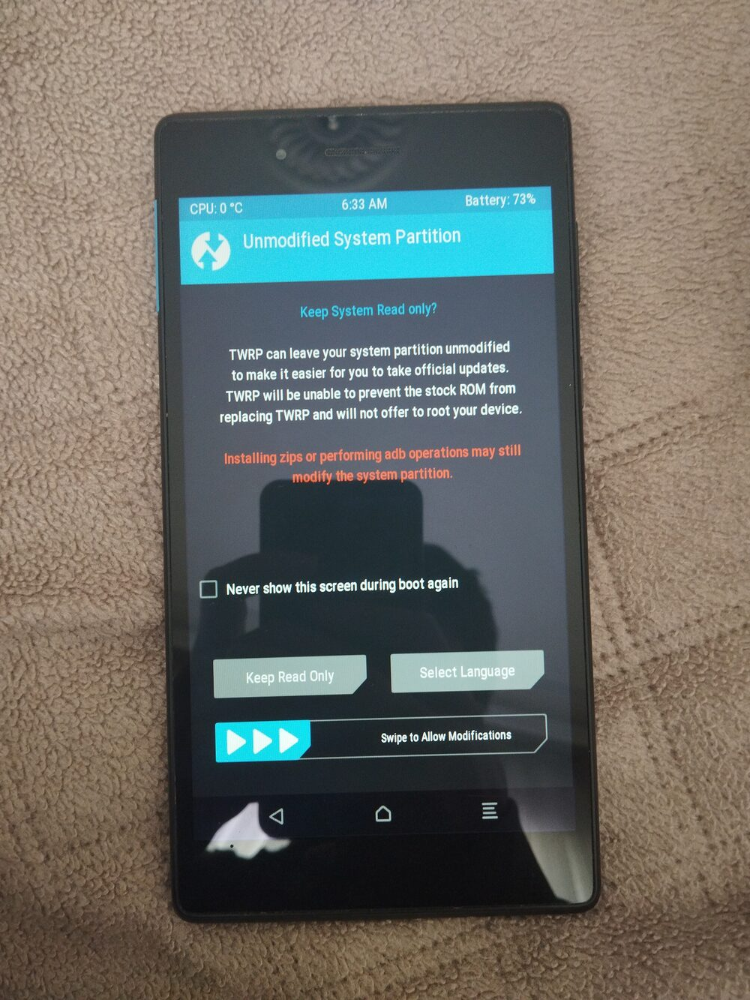

# TWRP device tree for Lenovo Tab 7 Essential (TB-7304F)

MediaTek MT8167, Android 7.0, 1024x600. Built against the `twrp-9.0` minimal manifest
with the stock 4.4.22 kernel from `TB-7304F_S100017_200102_ROW`.

```
lunch omni_TB7304F-eng && mka recoveryimage
```

The GitHub Actions workflow publishes two images: `recovery.img` and
`recovery-mtk.img` (same image with MediaTek headers on the kernel and ramdisk).
The image with MediaTek headers is the one confirmed to boot on the device:

```
fastboot flash recovery twrp-3.7.0_9-TB7304F.img
```

Boot straight into recovery after flashing, the stock ROM restores the stock
recovery otherwise.



Kernel and init files come from
[RajendranDinesh/twrp_device_tree_TB_7304F](https://github.com/RajendranDinesh/twrp_device_tree_TB_7304F).
